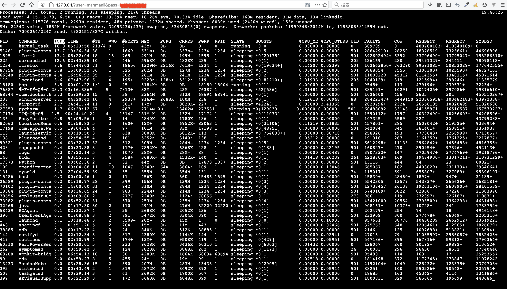

# Install
> pip install -r requirements.txt

# Running
> config.yaml
```yaml
WEBSERVER:
  middlewares:
    - project.middles.static_files:StaticFilesMiddleware
  host: 0.0.0.0
  port: 80
WEBSOCKET:
  host: 0.0.0.0
  port: 8000
```

> namekox run server

> http://127.0.0.1/?host=`host`&port=`port`&user=`user`&pass=`pass`

```shell script
2021-02-26 10:55:43,684 DEBUG load container class from namekox_core.core.service.container:ServiceContainer
2021-02-26 10:55:43,686 DEBUG starting services [u'webssh']
2021-02-26 10:55:43,686 DEBUG starting service webssh entrypoints [webssh:namekox_webserver.core.entrypoints.app.server.WebServer:server, webssh:namekox_websocket.core.entrypoints.app.server.WssServer:server, webssh:namekox_webserver.core.entrypoints.app.handler.WebServerHandler:index, webssh:project.common.handler.WebSocketHandler:monitor]
2021-02-26 10:55:43,691 DEBUG spawn manage thread handle webssh:namekox_webserver.core.entrypoints.app.server:handle_connect(args=(), kwargs={}, tid=handle_connect)
2021-02-26 10:55:43,692 DEBUG spawn manage thread handle webssh:namekox_webserver.core.entrypoints.app.server:handle_connect(args=(), kwargs={}, tid=handle_connect)
2021-02-26 10:55:43,693 DEBUG service webssh entrypoints [webssh:namekox_webserver.core.entrypoints.app.server.WebServer:server, webssh:namekox_websocket.core.entrypoints.app.server.WssServer:server, webssh:namekox_webserver.core.entrypoints.app.handler.WebServerHandler:index, webssh:project.common.handler.WebSocketHandler:monitor] started
2021-02-26 10:55:43,694 DEBUG starting service webssh dependencies []
2021-02-26 10:55:43,694 DEBUG service webssh dependencies [] started
2021-02-26 10:55:43,694 DEBUG services [u'webssh'] started
2021-02-26 10:55:50,452 DEBUG spawn manage thread handle webssh:namekox_webserver.core.entrypoints.app.server:handle_request(args=(<eventlet.greenio.base.GreenSocket object at 0x10ce68410>, ('127.0.0.1', 60418)), kwargs={}, tid=handle_request)
2021-02-26 10:55:50,453 DEBUG spawn manage thread handle webssh:namekox_webserver.core.entrypoints.app.server:handle_request(args=(<eventlet.greenio.base.GreenSocket object at 0x10ce68290>, ('127.0.0.1', 60419)), kwargs={}, tid=handle_request)
127.0.0.1 - - [26/Feb/2021 10:55:50] "GET /frontend/index.html?host=127.0.0.1&port=22&user=manmanli&pass=manmanli HTTP/1.1" 200 4574 0.013296
127.0.0.1 - - [26/Feb/2021 10:55:50] "GET /frontend/static/css/xterm.min.css HTTP/1.1" 200 1691 0.002978
2021-02-26 10:55:50,739 DEBUG spawn manage thread handle webssh:namekox_webserver.core.entrypoints.app.server:handle_request(args=(<eventlet.greenio.base.GreenSocket object at 0x10ce68510>, ('127.0.0.1', 60423)), kwargs={}, tid=handle_request)
2021-02-26 10:55:50,741 DEBUG starting thread (client mode): 0xceb0890L
2021-02-26 10:55:50,741 DEBUG Local version/idstring: SSH-2.0-paramiko_2.7.2
2021-02-26 10:55:50,811 DEBUG Remote version/idstring: SSH-2.0-OpenSSH_8.1
2021-02-26 10:55:50,812 INFO Connected (version 2.0, client OpenSSH_8.1)
2021-02-26 10:55:50,827 DEBUG kex algos:[u'curve25519-sha256', u'curve25519-sha256@libssh.org', u'ecdh-sha2-nistp256', u'ecdh-sha2-nistp384', u'ecdh-sha2-nistp521', u'diffie-hellman-group-exchange-sha256', u'diffie-hellman-group16-sha512', u'diffie-hellman-group18-sha512', u'diffie-hellman-group14-sha256', u'diffie-hellman-group14-sha1'] server key:[u'rsa-sha2-512', u'rsa-sha2-256', u'ssh-rsa', u'ecdsa-sha2-nistp256', u'ssh-ed25519'] client encrypt:[u'chacha20-poly1305@openssh.com', u'aes128-ctr', u'aes192-ctr', u'aes256-ctr', u'aes128-gcm@openssh.com', u'aes256-gcm@openssh.com'] server encrypt:[u'chacha20-poly1305@openssh.com', u'aes128-ctr', u'aes192-ctr', u'aes256-ctr', u'aes128-gcm@openssh.com', u'aes256-gcm@openssh.com'] client mac:[u'umac-64-etm@openssh.com', u'umac-128-etm@openssh.com', u'hmac-sha2-256-etm@openssh.com', u'hmac-sha2-512-etm@openssh.com', u'hmac-sha1-etm@openssh.com', u'umac-64@openssh.com', u'umac-128@openssh.com', u'hmac-sha2-256', u'hmac-sha2-512', u'hmac-sha1'] server mac:[u'umac-64-etm@openssh.com', u'umac-128-etm@openssh.com', u'hmac-sha2-256-etm@openssh.com', u'hmac-sha2-512-etm@openssh.com', u'hmac-sha1-etm@openssh.com', u'umac-64@openssh.com', u'umac-128@openssh.com', u'hmac-sha2-256', u'hmac-sha2-512', u'hmac-sha1'] client compress:[u'none', u'zlib@openssh.com'] server compress:[u'none', u'zlib@openssh.com'] client lang:[u''] server lang:[u''] kex follows?False
2021-02-26 10:55:50,828 DEBUG Kex agreed: curve25519-sha256@libssh.org
2021-02-26 10:55:50,828 DEBUG HostKey agreed: ssh-ed25519
2021-02-26 10:55:50,828 DEBUG Cipher agreed: aes128-ctr
2021-02-26 10:55:50,828 DEBUG MAC agreed: hmac-sha2-256
2021-02-26 10:55:50,828 DEBUG Compression agreed: none
2021-02-26 10:55:50,835 DEBUG kex engine KexCurve25519 specified hash_algo <built-in function openssl_sha256>
2021-02-26 10:55:50,836 DEBUG Switch to new keys ...
2021-02-26 10:55:50,842 DEBUG Adding ssh-ed25519 host key for 127.0.0.1: 058c5041a3e8ea43695e5861cde36fd8
2021-02-26 10:55:50,843 DEBUG userauth is OK
2021-02-26 10:55:51,441 INFO Authentication (password) successful!
2021-02-26 10:55:51,464 DEBUG [chan 0] Max packet in: 32768 bytes
2021-02-26 10:55:51,468 DEBUG Received global request "hostkeys-00@openssh.com"
2021-02-26 10:55:51,468 DEBUG Rejecting "hostkeys-00@openssh.com" global request from server.
2021-02-26 10:55:51,469 DEBUG [chan 0] Max packet out: 32768 bytes
2021-02-26 10:55:51,469 DEBUG Secsh channel 0 opened.
2021-02-26 10:55:51,504 DEBUG [chan 0] Sesch channel 0 request ok
2021-02-26 10:55:51,507 DEBUG spawn manage thread handle webssh:project.common.minissh:forward(args=(<eventlet.websocket.RFC6455WebSocket object at 0x10ceb06d0>,), kwargs={}, tid=forward)
2021-02-26 10:55:51,517 DEBUG [chan 0] Sesch channel 0 request ok
2021-02-26 10:55:53,475 DEBUG spawn worker thread handle webssh:monitor(args=(<Request 'http://127.0.0.1:8000/?host=127.0.0.1&port=22&user=manmanli&pass=manmanli&height=55&width=186' [GET]>, '232bc48b-f02a-4bd9-9247-2f31c95c22e4', u'l'), kwargs={}, context={})
2021-02-26 10:55:53,569 DEBUG spawn worker thread handle webssh:monitor(args=(<Request 'http://127.0.0.1:8000/?host=127.0.0.1&port=22&user=manmanli&pass=manmanli&height=55&width=186' [GET]>, '232bc48b-f02a-4bd9-9247-2f31c95c22e4', u's'), kwargs={}, context={})
2021-02-26 10:55:53,723 DEBUG spawn worker thread handle webssh:monitor(args=(<Request 'http://127.0.0.1:8000/?host=127.0.0.1&port=22&user=manmanli&pass=manmanli&height=55&width=186' [GET]>, '232bc48b-f02a-4bd9-9247-2f31c95c22e4', u' '), kwargs={}, context={})
2021-02-26 10:55:53,927 DEBUG spawn worker thread handle webssh:monitor(args=(<Request 'http://127.0.0.1:8000/?host=127.0.0.1&port=22&user=manmanli&pass=manmanli&height=55&width=186' [GET]>, '232bc48b-f02a-4bd9-9247-2f31c95c22e4', u'-'), kwargs={}, context={})
2021-02-26 10:55:54,097 DEBUG spawn worker thread handle webssh:monitor(args=(<Request 'http://127.0.0.1:8000/?host=127.0.0.1&port=22&user=manmanli&pass=manmanli&height=55&width=186' [GET]>, '232bc48b-f02a-4bd9-9247-2f31c95c22e4', u'l'), kwargs={}, context={})
2021-02-26 10:55:54,961 DEBUG spawn worker thread handle webssh:monitor(args=(<Request 'http://127.0.0.1:8000/?host=127.0.0.1&port=22&user=manmanli&pass=manmanli&height=55&width=186' [GET]>, '232bc48b-f02a-4bd9-9247-2f31c95c22e4', u'\n'), kwargs={}, context={})
2021-02-26 10:55:54,961 DEBUG ws_sock:232bc48b-f02a-4bd9-9247-2f31c95c22e4 input: ls -l
2021-02-26 10:55:57,837 DEBUG spawn worker thread handle webssh:monitor(args=(<Request 'http://127.0.0.1:8000/?host=127.0.0.1&port=22&user=manmanli&pass=manmanli&height=55&width=186' [GET]>, '232bc48b-f02a-4bd9-9247-2f31c95c22e4', u't'), kwargs={}, context={})
2021-02-26 10:55:57,997 DEBUG spawn worker thread handle webssh:monitor(args=(<Request 'http://127.0.0.1:8000/?host=127.0.0.1&port=22&user=manmanli&pass=manmanli&height=55&width=186' [GET]>, '232bc48b-f02a-4bd9-9247-2f31c95c22e4', u'o'), kwargs={}, context={})
2021-02-26 10:55:58,160 DEBUG spawn worker thread handle webssh:monitor(args=(<Request 'http://127.0.0.1:8000/?host=127.0.0.1&port=22&user=manmanli&pass=manmanli&height=55&width=186' [GET]>, '232bc48b-f02a-4bd9-9247-2f31c95c22e4', u'p'), kwargs={}, context={})
2021-02-26 10:55:58,428 DEBUG spawn worker thread handle webssh:monitor(args=(<Request 'http://127.0.0.1:8000/?host=127.0.0.1&port=22&user=manmanli&pass=manmanli&height=55&width=186' [GET]>, '232bc48b-f02a-4bd9-9247-2f31c95c22e4', u'\n'), kwargs={}, context={})
2021-02-26 10:55:58,428 DEBUG ws_sock:232bc48b-f02a-4bd9-9247-2f31c95c22e4 input: top
2021-02-26 10:56:01,811 DEBUG spawn worker thread handle webssh:monitor(args=(<Request 'http://127.0.0.1:8000/?host=127.0.0.1&port=22&user=manmanli&pass=manmanli&height=55&width=186' [GET]>, '232bc48b-f02a-4bd9-9247-2f31c95c22e4', u'\x03'), kwargs={}, context={})
^C2021-02-26 10:56:17,735 DEBUG stopping services [u'webssh']
2021-02-26 10:56:17,736 DEBUG stopping service webssh entrypoints [webssh:namekox_webserver.core.entrypoints.app.server.WebServer:server, webssh:namekox_websocket.core.entrypoints.app.server.WssServer:server, webssh:namekox_webserver.core.entrypoints.app.handler.WebServerHandler:index, webssh:project.common.handler.WebSocketHandler:monitor]
2021-02-26 10:56:17,738 DEBUG wait service webssh entrypoints [webssh:namekox_webserver.core.entrypoints.app.server.WebServer:server, webssh:namekox_websocket.core.entrypoints.app.server.WssServer:server, webssh:namekox_webserver.core.entrypoints.app.handler.WebServerHandler:index, webssh:project.common.handler.WebSocketHandler:monitor] stop
2021-02-26 10:56:17,739 DEBUG service webssh entrypoints [webssh:namekox_webserver.core.entrypoints.app.server.WebServer:server, webssh:namekox_websocket.core.entrypoints.app.server.WssServer:server, webssh:namekox_webserver.core.entrypoints.app.handler.WebServerHandler:index, webssh:project.common.handler.WebSocketHandler:monitor] stopped
2021-02-26 10:56:17,739 DEBUG stopping service webssh dependencies []
2021-02-26 10:56:17,739 DEBUG service webssh dependencies [] stopped
2021-02-26 10:56:17,741 DEBUG services [u'webssh'] stopped
2021-02-26 10:56:17,741 DEBUG killing services [u'webssh']
2021-02-26 10:56:17,742 DEBUG service webssh already stopped
2021-02-26 10:56:17,743 DEBUG services [u'webssh'] killed
2021-02-26 10:56:17,773 DEBUG EOF in transport thread
127.0.0.1 - - [26/Feb/2021 10:56:17] "GET /?host=127.0.0.1&port=22&user=manmanli&pass=manmanli&height=55&width=186 HTTP/1.1" 200 0 27.035033
```
