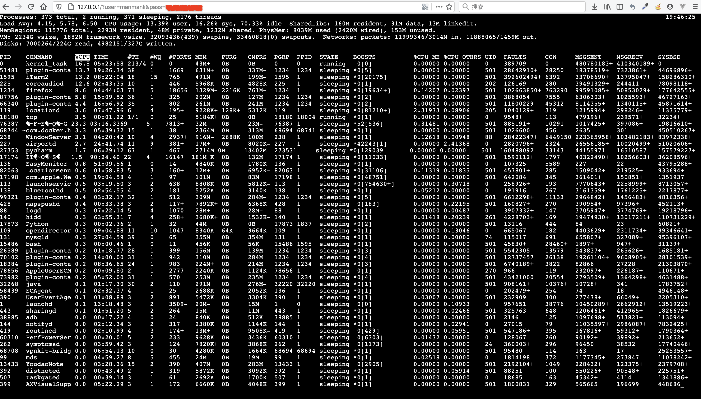

# Install
> pip install -r requirements.txt

# Running
> config.yaml
```yaml
WEBSERVER:
  host: 0.0.0.0
  port: 80
  middlewares:
    - middlewares:SharedData
WEBSOCKET:
  host: 0.0.0.0
  port: 8000
```

> namekox run server
```shell script
2020-09-24 19:45:46,994 DEBUG load service classes from server failed,
2020-09-24 19:45:47,293 DEBUG load container class from namekox_core.core.service.container:ServiceContainer
2020-09-24 19:45:47,294 DEBUG starting services ['webssh']
2020-09-24 19:45:47,294 DEBUG starting service webssh entrypoints [webssh:server.WebServer:server, webssh:server.WebServerHandler:index, webssh:namekox_websocket.core.entrypoints.app.server.WssServer:server, webssh:server.WebSocketHandler:monitor]
2020-09-24 19:45:47,296 DEBUG spawn manage thread handle webssh:namekox_webserver.core.entrypoints.app.server:handle_connect(args=(), kwargs={}, tid=handle_connect)
2020-09-24 19:45:47,297 DEBUG spawn manage thread handle webssh:namekox_websocket.core.server:handle_connect(args=(), kwargs={}, tid=handle_connect)
2020-09-24 19:45:47,297 DEBUG service webssh entrypoints [webssh:server.WebServer:server, webssh:server.WebServerHandler:index, webssh:namekox_websocket.core.entrypoints.app.server.WssServer:server, webssh:server.WebSocketHandler:monitor] started
2020-09-24 19:45:47,297 DEBUG starting service webssh dependencies []
2020-09-24 19:45:47,297 DEBUG service webssh dependencies [] started
2020-09-24 19:45:47,298 DEBUG services ['webssh'] started
2020-09-24 19:45:55,541 DEBUG spawn manage thread handle webssh:namekox_webserver.core.entrypoints.app.server:handle_request(args=(<eventlet.greenio.base.GreenSocket object at 0x108392a50>, ('127.0.0.1', 59482)), kwargs={}, tid=handle_request)
2020-09-24 19:45:55,543 DEBUG spawn worker thread handle webssh:index(args=(<Request 'http://127.0.0.1/?user=*&pass=*' [GET]>,), kwargs={}, context={})
127.0.0.1 - - [24/Sep/2020 19:45:55] "GET /?user=*&pass=* HTTP/1.1" 200 4147 0.002361
127.0.0.1 - - [24/Sep/2020 19:45:55] "GET /static/js/jquery.min.js HTTP/1.1" 304 189 0.008356
2020-09-24 19:45:55,661 DEBUG spawn manage thread handle webssh:namekox_webserver.core.entrypoints.app.server:handle_request(args=(<eventlet.greenio.base.GreenSocket object at 0x1083928d0>, ('127.0.0.1', 59483)), kwargs={}, tid=handle_request)
2020-09-24 19:45:55,661 DEBUG spawn manage thread handle webssh:namekox_webserver.core.entrypoints.app.server:handle_request(args=(<eventlet.greenio.base.GreenSocket object at 0x1083f2ad0>, ('127.0.0.1', 59484)), kwargs={}, tid=handle_request)
2020-09-24 19:45:55,661 DEBUG spawn manage thread handle webssh:namekox_webserver.core.entrypoints.app.server:handle_request(args=(<eventlet.greenio.base.GreenSocket object at 0x1083f2d10>, ('127.0.0.1', 59485)), kwargs={}, tid=handle_request)
127.0.0.1 - - [24/Sep/2020 19:45:55] "GET /static/js/xterm.min.js HTTP/1.1" 304 190 0.000569
127.0.0.1 - - [24/Sep/2020 19:45:55] "GET /static/js/addons/fit.min.js HTTP/1.1" 304 188 0.000487
127.0.0.1 - - [24/Sep/2020 19:45:55] "GET /static/js/addons/fullscreen.min.js HTTP/1.1" 304 189 0.000471
2020-09-24 19:45:55,789 DEBUG spawn manage thread handle webssh:namekox_websocket.core.server:handle_request(args=(<eventlet.greenio.base.GreenSocket object at 0x108392cd0>, ('127.0.0.1', 59486)), kwargs={}, tid=handle_request)
2020-09-24 19:45:55,831 DEBUG starting thread (client mode): 0x8400e10L
2020-09-24 19:45:55,834 DEBUG Local version/idstring: SSH-2.0-paramiko_2.7.2
2020-09-24 19:45:55,889 DEBUG Remote version/idstring: SSH-2.0-OpenSSH_7.9
2020-09-24 19:45:55,890 INFO Connected (version 2.0, client OpenSSH_7.9)
2020-09-24 19:45:55,917 DEBUG kex algos:[u'curve25519-sha256', u'curve25519-sha256@libssh.org', u'ecdh-sha2-nistp256', u'ecdh-sha2-nistp384', u'ecdh-sha2-nistp521', u'diffie-hellman-group-exchange-sha256', u'diffie-hellman-group16-sha512', u'diffie-hellman-group18-sha512', u'diffie-hellman-group14-sha256', u'diffie-hellman-group14-sha1'] server key:[u'rsa-sha2-512', u'rsa-sha2-256', u'ssh-rsa', u'ecdsa-sha2-nistp256', u'ssh-ed25519'] client encrypt:[u'chacha20-poly1305@openssh.com', u'aes128-ctr', u'aes192-ctr', u'aes256-ctr', u'aes128-gcm@openssh.com', u'aes256-gcm@openssh.com'] server encrypt:[u'chacha20-poly1305@openssh.com', u'aes128-ctr', u'aes192-ctr', u'aes256-ctr', u'aes128-gcm@openssh.com', u'aes256-gcm@openssh.com'] client mac:[u'umac-64-etm@openssh.com', u'umac-128-etm@openssh.com', u'hmac-sha2-256-etm@openssh.com', u'hmac-sha2-512-etm@openssh.com', u'hmac-sha1-etm@openssh.com', u'umac-64@openssh.com', u'umac-128@openssh.com', u'hmac-sha2-256', u'hmac-sha2-512', u'hmac-sha1'] server mac:[u'umac-64-etm@openssh.com', u'umac-128-etm@openssh.com', u'hmac-sha2-256-etm@openssh.com', u'hmac-sha2-512-etm@openssh.com', u'hmac-sha1-etm@openssh.com', u'umac-64@openssh.com', u'umac-128@openssh.com', u'hmac-sha2-256', u'hmac-sha2-512', u'hmac-sha1'] client compress:[u'none', u'zlib@openssh.com'] server compress:[u'none', u'zlib@openssh.com'] client lang:[u''] server lang:[u''] kex follows?False
2020-09-24 19:45:55,917 DEBUG Kex agreed: curve25519-sha256@libssh.org
2020-09-24 19:45:55,918 DEBUG HostKey agreed: ssh-ed25519
2020-09-24 19:45:55,918 DEBUG Cipher agreed: aes128-ctr
2020-09-24 19:45:55,918 DEBUG MAC agreed: hmac-sha2-256
2020-09-24 19:45:55,919 DEBUG Compression agreed: none
2020-09-24 19:45:55,946 DEBUG kex engine KexCurve25519 specified hash_algo <built-in function openssl_sha256>
2020-09-24 19:45:55,960 DEBUG Switch to new keys ...
2020-09-24 19:45:55,968 DEBUG Adding ssh-ed25519 host key for 127.0.0.1: 058c5041a3e8ea43695e5861cde36fd8
2020-09-24 19:45:55,971 DEBUG userauth is OK
2020-09-24 19:45:56,803 INFO Authentication (password) successful!
2020-09-24 19:45:56,804 DEBUG [chan 0] Max packet in: 32768 bytes
2020-09-24 19:45:56,821 DEBUG Received global request "hostkeys-00@openssh.com"
2020-09-24 19:45:56,821 DEBUG Rejecting "hostkeys-00@openssh.com" global request from server.
2020-09-24 19:45:56,821 DEBUG [chan 0] Max packet out: 32768 bytes
2020-09-24 19:45:56,821 DEBUG Secsh channel 0 opened.
2020-09-24 19:45:56,849 DEBUG [chan 0] Sesch channel 0 request ok
2020-09-24 19:45:56,850 DEBUG spawn manage thread handle webssh:minissh:forward(args=(<eventlet.websocket.RFC6455WebSocket object at 0x108400b90>,), kwargs={}, tid=forward)
2020-09-24 19:45:56,854 DEBUG [chan 0] Sesch channel 0 request ok
2020-09-24 19:46:03,116 DEBUG spawn worker thread handle webssh:monitor(args=(<Request 'http://127.0.0.1:8000/?user=*&pass=*&height=55&width=186' [GET]>, 'bd028f67-6c65-4966-ac66-fc1edf675462', u't'), kwargs={}, context={})
2020-09-24 19:46:03,274 DEBUG spawn worker thread handle webssh:monitor(args=(<Request 'http://127.0.0.1:8000/?user=*&pass=*&height=55&width=186' [GET]>, 'bd028f67-6c65-4966-ac66-fc1edf675462', u'o'), kwargs={}, context={})
2020-09-24 19:46:03,412 DEBUG spawn worker thread handle webssh:monitor(args=(<Request 'http://127.0.0.1:8000/?user=*&pass=*&height=55&width=186' [GET]>, 'bd028f67-6c65-4966-ac66-fc1edf675462', u'p'), kwargs={}, context={})
2020-09-24 19:46:03,674 DEBUG spawn worker thread handle webssh:monitor(args=(<Request 'http://127.0.0.1:8000/?user=*&pass=*&height=55&width=186' [GET]>, 'bd028f67-6c65-4966-ac66-fc1edf675462', u'\n'), kwargs={}, context={})
2020-09-24 19:46:03,675 DEBUG ws_sock:bd028f67-6c65-4966-ac66-fc1edf675462 input: top
2020-09-24 19:47:13,053 DEBUG spawn worker thread handle webssh:monitor(args=(<Request 'http://127.0.0.1:8000/?user=*&pass=*&height=55&width=186' [GET]>, 'bd028f67-6c65-4966-ac66-fc1edf675462', u'\x03'), kwargs={}, context={})
^C2020-09-24 19:47:28,075 DEBUG stopping services ['webssh']
2020-09-24 19:47:28,076 DEBUG stopping service webssh entrypoints [webssh:server.WebServer:server, webssh:server.WebServerHandler:index, webssh:namekox_websocket.core.entrypoints.app.server.WssServer:server, webssh:server.WebSocketHandler:monitor]
2020-09-24 19:47:28,077 DEBUG wait service webssh entrypoints [webssh:server.WebServer:server, webssh:server.WebServerHandler:index, webssh:namekox_websocket.core.entrypoints.app.server.WssServer:server, webssh:server.WebSocketHandler:monitor] stop
2020-09-24 19:47:28,077 DEBUG service webssh entrypoints [webssh:server.WebServer:server, webssh:server.WebServerHandler:index, webssh:namekox_websocket.core.entrypoints.app.server.WssServer:server, webssh:server.WebSocketHandler:monitor] stopped
2020-09-24 19:47:28,077 DEBUG stopping service webssh dependencies []
2020-09-24 19:47:28,077 DEBUG service webssh dependencies [] stopped
127.0.0.1 - - [24/Sep/2020 19:47:28] "GET /?user=*&pass=*&height=55&width=186 HTTP/1.1" 200 0 92.287338
2020-09-24 19:47:28,079 DEBUG services ['webssh'] stopped
2020-09-24 19:47:28,079 DEBUG killing services ['webssh']
2020-09-24 19:47:28,081 DEBUG service webssh already stopped
2020-09-24 19:47:28,082 DEBUG services ['webssh'] killed
2020-09-24 19:47:28,160 DEBUG EOF in transport thread
```

> open http://127.0.0.1/?host=`host`&port=`port`&user=`user`&pass=`pass`

